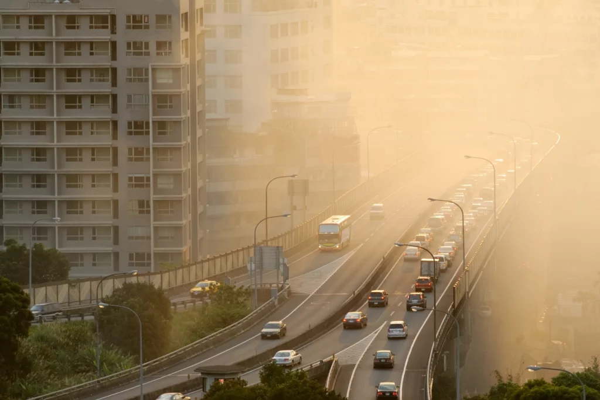

# Air_Pollution_Project

---

## 🚀 Project Link

[Air Pollution Analysis](https://www.kaggle.com/code/samarthharde/air-pollution-project)

---

## 📌 Overview  
This project explores air pollution data across cities in the **United States**. It analyzes seasonal trends, pollutant impact (PM2.5, NO2, O3, CO, etc.), and regional AQI patterns using visualizations and statistical analysis.

---

## 📂 Dataset  
 **air_pollution_data.csv** – Year-wise data for pollutants (PM2.5, NO2, SO2, CO, O3) and AQI across U.S. cities. 

 **Source**: [U.S. Air Quality Dataset](https://www.kaggle.com/datasets/sogun3/uspollution)

---

## 🛠 Technologies Used

- **Python**: Pandas, Matplotlib, Seaborn

---

## 📊 Insights

- **2000–2016**: AQI improved gradually over years.
    
- **Fontana & Rubidoux**: Most polluted cities by Max AQI.
  
- **NO2 AQI**: Dropped due to cleaner fuels and regulations.
    
- **Ozone AQI**: Slightly higher in South and Midwest.
   
- **CO AQI**: Stable but high in some areas.

---

## ✅ Recommendations

- Promote clean fuels and better vehicle standards.
    
- Monitor AQI closely in high-risk cities.
   
- Raise public awareness on seasonal air quality.
    
- Enforce stronger emission policies
